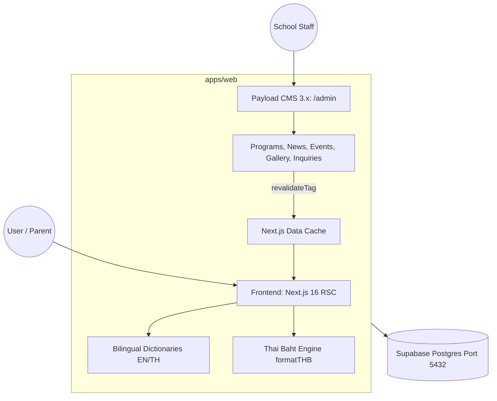

# System Architecture

## Overview
The Pakdeepan Kindergarten Website is built as a high-performance, SEO-optimized, and premium Next.js monorepo application. It leverages a modern stack designed for speed, security, and scalability while providing an intuitive CMS for non-technical school staff.

## Technology Stack
- **Framework:** Next.js 15 (App Router, Server Components, Turbopack)
- **Monorepo:** pnpm workspaces (Turborepo compatible architecture)
- **Styling:** Tailwind CSS v4, Framer Motion (animations)
- **Database:** PostgreSQL (via Supabase)
- **ORM:** Prisma
- **CMS:** Payload CMS 3.0 (Self-hosted, Next.js integrated)
- **Authentication:** Supabase Auth (SSR middleware)
- **Forms & Validation:** React Hook Form, Zod

## System Design & Data Flow
1. **Integrated Web & CMS (`apps/web`)**: Next.js 16 App Router application hosting both the public school website and the integrated Payload CMS 3.x administration panel (`/admin`).
2. **Database Layer**: PostgreSQL hosted on Supabase, connected via the Session Mode pooler (port 5432) for reliable schema management and DDL operations.
3. **Bilingual Engine**: Integrated `next/headers` cookies (`NEXT_LOCALE`) with server-side dictionary hydration (`src/dictionaries/th.json`, `en.json`) and Payload CMS field-level localization (`locales: ['en', 'th']`).
4. **Currency Engine (`src/utils/currency.ts`)**: Centralized Thai Baht (`THB` / `฿`) precision formatting utility applying `Intl.NumberFormat`, handling zero-decimal tuition displays and bilingual billing intervals.
5. **Real-Time Data Invalidation**: Payload collection `afterChange` hooks dispatch Next.js `revalidateTag` calls (`home-cache`, `programs-cache`, `news-cache`), keeping edge cached static pages immediately synchronized with CMS updates.

### High-Level Architecture Diagram

## Design Methodology
- **Server-First approach:** We heavily utilize React Server Components (RSC) to reduce the client-side JavaScript bundle, only hydrating interactive islands (marked with `"use client"`).
- **Component-Driven Development:** All visual building blocks are encapsulated in `packages/ui` and collocated components to prevent duplicated styles and maintain a single source of truth for the design system.
- **Edge & On-Demand Invalidation:** Fast static rendering with on-demand tag revalidation ensures pages load in sub-100ms while reflecting instant CMS modifications.
